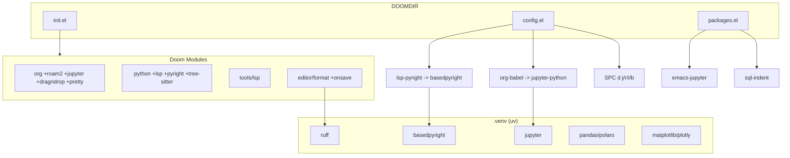

# Configuracion DOOMDIR para Data Science

## Correcciones al Documento Maestro

Antes de implementar, hay 3 discrepancias entre la solicitud y la arquitectura real de Doom Emacs:

- `**(jupyter)` no existe como modulo standalone**: Jupyter se habilita como flag del modulo org: `(org +jupyter)`. Se fusionara con la linea de org.
- `**(sql +lsp)` no existe en Doom**: No hay modulo `:lang sql` en Doom Emacs. Se configurara SQL manualmente via `packages.el` y `config.el` con `sql-mode` (built-in) + paquetes adicionales.
- `**:tools lsp**` esta actualmente comentado. Debe habilitarse (sin `+eglot`) para que `+lsp` y `+pyright` funcionen en el modulo python.

## Fase 1: Entorno Virtual (Shell)

Crear el venv y instalar dependencias:

```bash
uv venv ~/.config/doom/.venv
uv pip install basedpyright ruff pandas polars matplotlib plotly jupyter --python ~/.config/doom/.venv/bin/python
```

## Fase 2: Modulos - `init.el`

Archivo: `[init.el](init.el)`

Cambios puntuales sobre el archivo existente:

- `**:editor**` - Descomentar format con onsave:
  - `;;(format +onsave)` -> `(format +onsave)`
- `**:tools**` - Habilitar LSP (sin +eglot) y tree-sitter:
  - `;;(lsp +eglot)` -> `lsp`
  - `;;tree-sitter` -> `tree-sitter`
- `**:lang**` - Habilitar python, mejorar org, habilitar data:
  - `;;data` -> `data`
  - `org` -> `(org +roam2 +jupyter +dragndrop +pretty)`
  - `;;python` -> `(python +lsp +pyright +tree-sitter)`

## Fase 3: Paquetes - `packages.el`

Archivo: `[packages.el](packages.el)`

Anadir al final del archivo:

```elisp
;; Data Science & Jupyter
(package! jupyter)           ; emacs-jupyter (org +jupyter lo requiere)
(package! code-cells)        ; navegacion estilo notebook en .py

;; SQL & BigQuery
(package! sql-indent)        ; indentacion SQL mejorada
```

Nota: `emacs-jupyter` deberia instalarse automaticamente con `(org +jupyter)`, pero declararlo explicitamente en `packages.el` garantiza su presencia y permite pinning.

## Fase 4: Configuracion - `config.el`

Archivo: `[config.el](config.el)`

### 4a. Integracion Jupyter + Org-Babel

```elisp
(after! org
  (setq org-image-actual-width '(450))
  (add-hook 'org-babel-after-execute-hook #'org-display-inline-images))

(after! jupyter
  (setq jupyter-repl-echo-eval-p t))
```

### 4b. LSP & Python (basedpyright)

```elisp
(after! lsp-pyright
  (setq lsp-pyright-langserver-command "basedpyright"
        lsp-pyright-venv-path "~/.config/doom/.venv"))
```

### 4c. Formato con Ruff

```elisp
(after! format
  (set-formatter! 'ruff
    '("ruff" "format" "--stdin-filename" buffer-file-name "-")
    :modes '(python-mode python-ts-mode)))
```

### 4d. SQL / BigQuery

```elisp
(after! sql
  (setq sql-product 'ansi)
  (sql-set-product-feature 'ansi :prompt-regexp "^.*> "))
```

### 4e. Keybindings (Spacemacs Style)

```elisp
(map! :leader
      :prefix ("d" . "data-science")
      :desc "Ejecutar celda Jupyter"    "j" #'jupyter-eval-line-or-region
      :desc "Reiniciar kernel Jupyter"  "r" #'jupyter-repl-restart-kernel
      :desc "Inspeccionar objeto"       "i" #'lsp-describe-thing-at-point
      :desc "Conectar BigQuery (SQL)"   "b" #'sql-connect)
```

## Fase 5: Sync y Validacion

```bash
~/.config/emacs/bin/doom sync
```

Luego en Emacs: `SPC h r r` para recargar la configuracion.

## Diagrama de Arquitectura




